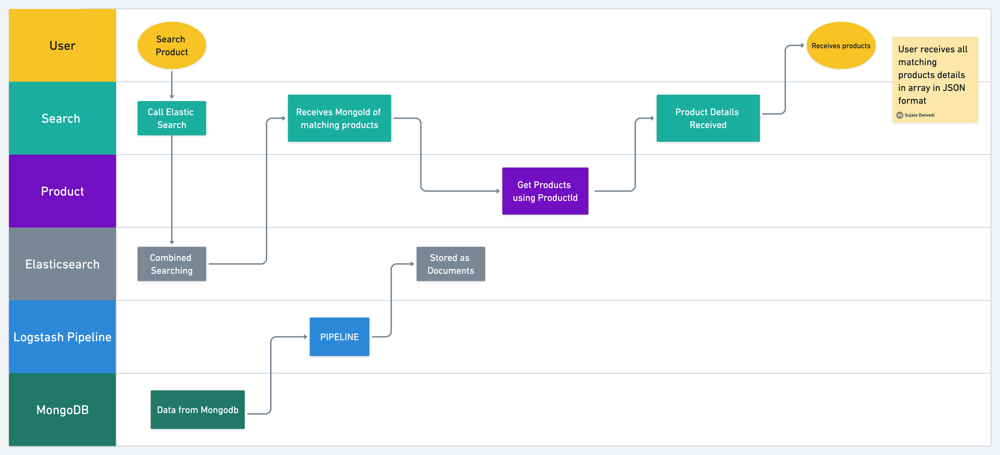

# Mini Project - ShopKart - Online Shopping Store

## Services

- **Auth**
- **Product**
- **Search**
- **Cart**
- **Order**

## Tech Stack

- Golang
- Sonarqube
- JWT
- ElasticSearch
- Logstash
- Mongodb
- Kafka
- Swagger

## Auth Service

It uses private/public key for JWT creation. It uses private key to sign the JWT token and public key can be used to authenticated the JWT token by other services.
To generate public and private keys, run the `mkdir keys` command inside `auth/cmd/server`. Then, run the following commands inside `auth/cmd/server/keys` to generate the public and private keys for local configuration/testing of the service.  

1. Command to generate RSA private key:
   `openssl genrsa -out app.rsa 2048`

2. Command to generate RSA public key:
   `openssl rsa -in app.rsa -pubout > app.rsa.pub`

This service mainly does sign up of new user and sign in of the user by returning back the JWT token signed by private key.

## Product Service

This service allows the following endpoints

1. POST `product/v1/product` - User with Role `SELLER` can add the product to the mongo database. It accepts product information in the request body and JWT token in authorization header for authentication as well as authorisation purpose.

## Search Service

Elastic search and `Search` service working is documented inside the `elasticsearch` directory. It also contains info/related documents for data syncing with logstash between mongodb and elastic search.  

## Cart Service

This service allows user of type `BUYER` to add a product to his/her cart, delete a product from the cart and then, can fetch all the products of the cart using GetCart API.

## Order Service

- It allows user to create order. The cart details for the user is converted to order and stored with Order Status `ORDER_PLACED`. It publishes the details to Kafka Topic `OrderStatus`.  
  Cart service has subscribed to Kafka Topic `OrderStatus` and delete the cart for that user once the order is in status `ORDER_PLACED`.
- Allows to change the Order status.
- Endpoint to get all the details of the cart (Get Cart endpoint)

## Steps to run Sonarqube

- Run the following command in root of the project/microservices to generate coverage file. 
  > `go test -short -coverprofile=./cov.out ./...`
- Run the following command in root of the project/microservices to generate gosec report. 
  Install gosec from [Gosec Github link](https://github.com/securego/gosec) 
  > `gosec -fmt=sonarqube -out report.json ./...`
- SonarQube properties file is already present in the root of each service directory.
- Set the project in SonarQube and provide the same name in `sonar.projectKey` field and running address of SonarQube in `sonar.host.url` field of `sonar-project.properties`.
- Provide the generated authentication token by SonarQube in `sonar.login` field of `sonar-project.properties`.
- Run the `sonar-scanner` command to run sonar scanner and visit to dashboard for the analysis of the codebase.

## Setup Instructions

1. Create a folder `etc` inside every microservice and create a `config.localhost.env` file that will contain all the required keys, ports and variables.
2. `config.localhost.env` files

- For Auth Service

  > AUTH_PORT= 
  > AUTH_DB_COLLECTION= 
  > AUTH_DB= 
  > AUTH_MONGO_URL= 

- For Product Service

  > PRODUCT_PORT= 
  > PRODUCT_DB_COLLECTION= 
  > PRODUCT_DB= 
  > PRODUCT_MONGO_URL= 

- For Search Service

  > SEARCH_PORT= 
  > SEARCH_ELASTIC_SEARCH_URL= 
  > SEARCH_PRODUCT_SERVICE_URL= 

- For Cart Service

  > CART_PORT =  
  > CART_DB_COLLECTION =  
  > CART_DB =  
  > CART_MONGO_URL =  

- For Order Service

  > ORDER_PORT =  
  > ORDER_DB_COLLECTION =  
  > ORDER_DB =  
  > ORDER_MONGO_URL =  
  > ORDER_PRODUCT_BASE_URL =  

3. Run the following command to bring up the service `cd cmd/server` and `go run main.go`

## References

- Requirement Document - [Online Shopping Store](https://docs.google.com/document/d/1cnCHEVkOgFDYSmZmSbxcDlZiLjCZXr1W9jHf62id7T8/edit?usp=sharing)
- Combined Fields in Elastic Search - [Official Documentation](https://www.elastic.co/guide/en/elasticsearch/reference/current/query-dsl-combined-fields-query.html)
- [Go Elastic - Official Go client for ElasticSearch](https://github.com/elastic/go-elasticsearch)
- Working with go client for elasticsearch - [Elastic Blog](https://www.elastic.co/blog/the-go-client-for-elasticsearch-working-with-data)
